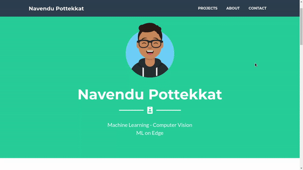

# Portfolio Website 

 

Hosted with ❤ by GitHub  

A portfolio website that can be used to show your projects or other information. The site is live at [navendu.me](https://navendu-pottekkat.github.io/)

If that does not convince you, here are some other reason that might make you build one:

* Your work will be seen by others.
* You will be able to see how you evolve.
* Who do you trust more? A person who *says* they have created something or a person who *shows* what they have created?

Here is a preview of the website.

## Editing / Personalisation

You can use this template to build your own portfolios. This was built using a Bootstrap template from [Start Bootstrap.](https://startbootstrap.com/)

You could click on the **Use this template** button or **Fork** this repository.

To make changes, all you would have to do would be to edit the `index.html` file. You can intuitively add your projects and information about yourself.

Here is a great [free tool](https://getavataaars.com/) to build your own avatars! 

## Using custom domain

You can edit the CNAME file in the root folder of this repo. You can use GitHub pages to host this website. More information on how to host your website using GitHub pages is available in the [documentation](https://help.github.com/en/github/working-with-github-pages/configuring-a-custom-domain-for-your-github-pages-site).

Please do leave a star if you found this helpful!

Happy coding!

## License
[MIT](https://choosealicense.com/licenses/mit/)
