I have been using [diagrams.net](https://www.diagrams.net/) and [Excalidraw](https://excalidraw.com/) for all my diagram needs. But I often had to modify these diagrams when I made a mistake or when they were outdated. Maintaining these diagrams consumed a lot of my time and effort. There has to be a better way, right?

I was writing a new blog post with many diagrams when I googled "diagrams in markdown" and found [Mermaid](https://mermaid-js.github.io/).

Mermaid lets you create diagrams by writing text in markdown files. It has an intuitive syntax and verbose documentation to help you make diagrams quickly.

It is also easy to add Mermaid to your Hugo blog. You can use [shortcodes](https://gohugo.io/content-management/shortcodes/) to add your diagrams in Mermaid syntax and have them rendered on your blog posts.

```mermaid
flowchart TB
    y("👫 You") --> s{Subscribed to navendu.me?}
    s --> |Yes| a("🥳 You are awesome!")
    s --> |No| su[/"Subscribe to navendu.me"/] --> a
    click su href "/subscribe" _blank
```




flowchart TB
    y("👫 You") --> s{Subscribed to navendu.me?}
    s --> |Yes| a("🥳 You are awesome!")
    s --> |No| su[/"Subscribe to navendu.me"/] --> a
    click su href "/subscribe" _blank


Check out the [official documentation](https://mermaid-js.github.io/) to learn more about Mermaid and its syntax.

This article will look at how you can add Mermaid to your Hugo blog.

## Import and Configure Mermaid

The first step is to import Mermaid. The simplest way to do this is by importing the minified file from a CDN.

Create a file `mermaid.html` in your `layouts/partials` directory. We will import and configure Mermaid here.


<script
  type="application/javascript"
  src="https://cdn.jsdelivr.net/npm/mermaid/dist/mermaid.min.js"
></script>
<script>
  var config = {
    startOnLoad: true,
    theme:'{{ if site.Params.mermaid.theme }}{{ site.Params.mermaid.theme }}{{ else }}dark{{ end }}',
    align:'{{ if site.Params.mermaid.align }}{{ site.Params.mermaid.align }}{{ else }}center{{ end }}',
  };
  mermaid.initialize(config);
</script>


The highlighted line looks for parameters in your site's configuration file (`config.yaml`). This makes it easy to change Mermaid's theme and alignment.

You can look for more [configuration options](https://mermaid-js.github.io/mermaid/#/Setup) in Mermaid docs. I only have these two configurations now and can add them to my site's configuration file.

```yaml
params:
    mermaid:
        theme: "dark"
        align: "center"
```

## Loading Mermaid on Required Pages

It is unnecessary to load Mermaid on every page in your blog. You only need it on pages where there are Mermaid diagrams.

We will only add the `layouts/partials/mermaid.html` file when a page needs it. To set this up, we will create a [front matter](https://gohugo.io/content-management/front-matter/) variable `mermaid`, which can be set to `true` to load Mermaid.

Now, in your page layout, you can check if this variable is set and load the `mermaid.html` partial file. My page layout file is `layouts/_default/single.html`.


<div class="post-content">
    {{- if not (.Param "disableAnchoredHeadings") }}
    {{- partial "anchored_headings.html" .Content -}}
    {{- else }}{{ .Content }}{{ end }}
    <!-- Add mermaid min js file -->
    {{ if (.Params.mermaid) }}
    {{ partial "mermaid.html" }}
    {{ end }}
    {{ partial "subscribe.html" . }}
</div>


You can now import Mermaid by setting the mermaid page variable to `true` in your markdown files as shown below:


---
title: "Adding Diagrams to Your Hugo Blog With Mermaid"
date: 2022-08-26T15:46:16+05:30
draft: true
weight: 14
ShowToc: true
TocOpen: true
mermaid: true
summary: "This article shows how you can add diagrams to your Hugo site with Mermaid."
tags: ["hugo", "mermaid", "blogs", "tutorials"]


## Creating the mermaid Shortcode

The final step is to create a shortcode to add diagrams in Mermaid syntax to your markdown files.

Create a new file `layouts/shortcodes/mermaid.html` with the below content:

```html
<div class="mermaid">{{.Inner}}</div>
```

That's it! Now to test it out, you can try using the shortcode as shown below:

```mermaid

flowchart LR
    y("👫 You") --> h{"🤝 Found this helpful?"}
    h --> |Yes| r[/"⭐ Check out my featured posts!"/]
    h --> |No| su[/"📝 Suggest changes by clicking near the title"/]
    click r "/categories/featured" _blank

```

After you save and build your site, you should be able to see this diagram rendered:


flowchart LR
    y("👫 You") --> h{"🤝 Found this helpful?"}
    h --> |Yes| r[/"⭐ Check out my featured posts!"/]
    h --> |No| su[/"📝 Suggest changes by clicking near the title"/]
    click r "/categories/featured" _blank


## Optional: Add CSS to Style the Diagrams

You can optionally add custom CSS to the `mermaid` class to change how your diagram looks.

You can add this CSS by creating a new file, `assets/css/mermaid.css`. My CSS file has the following content to make my diagrams look better on my posts:

```css
.mermaid {
    display: flex;
    justify-content: center;
    margin: 10px 0px 25px 0px
}
```

---

Mermaid is a free and open source project maintained by the community. You can [sponsor the project on GitHub](https://github.com/sponsors/knsv) to support its development.
